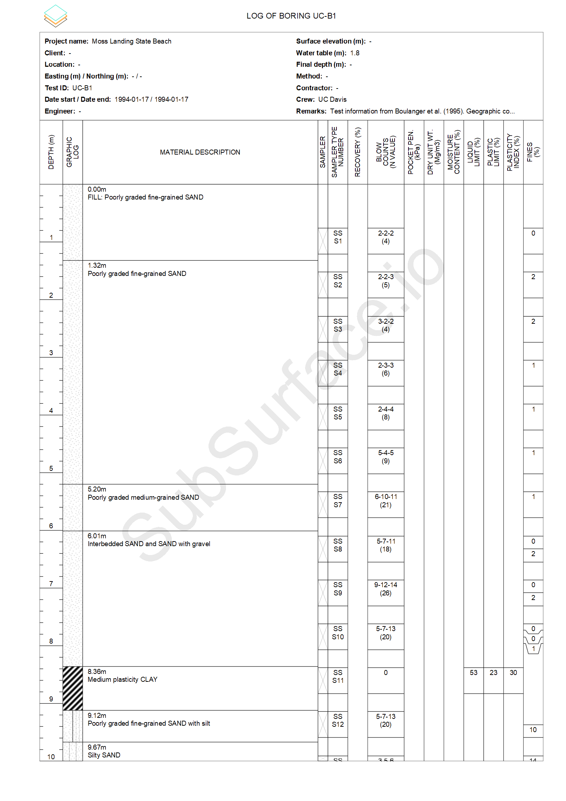
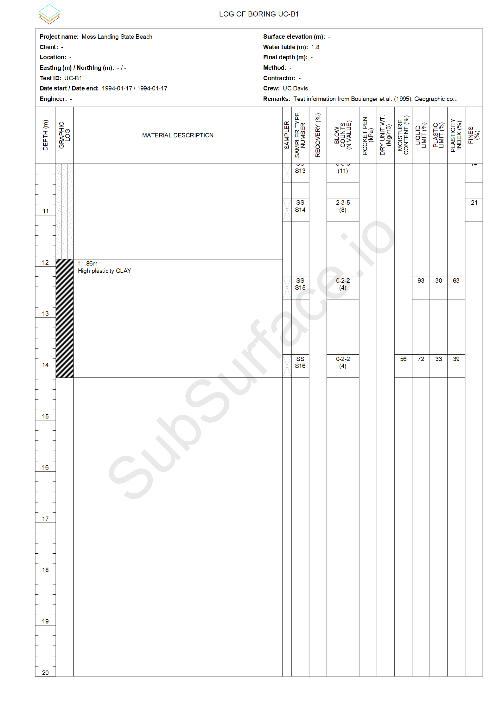
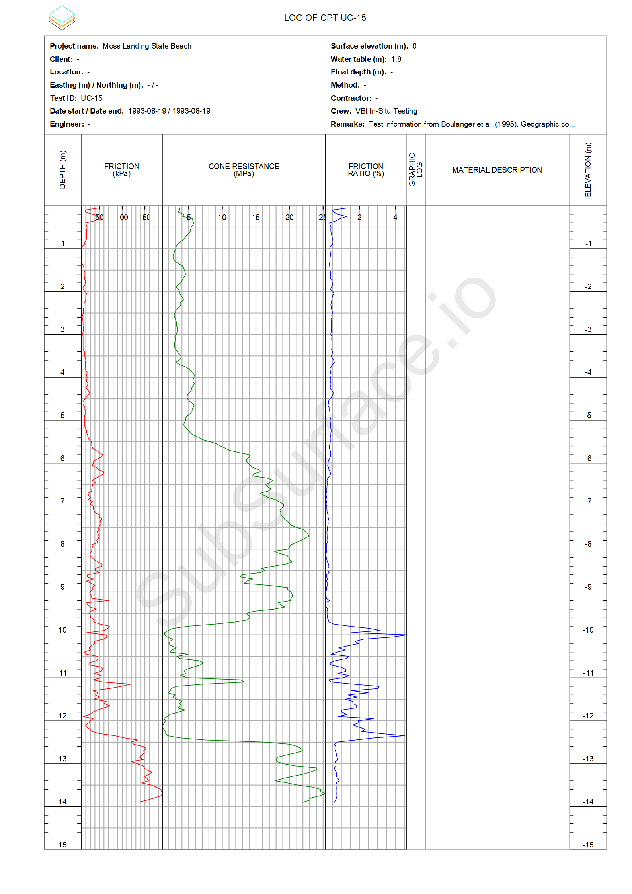
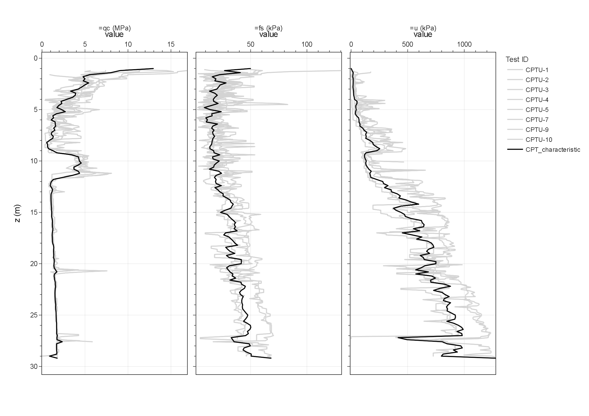
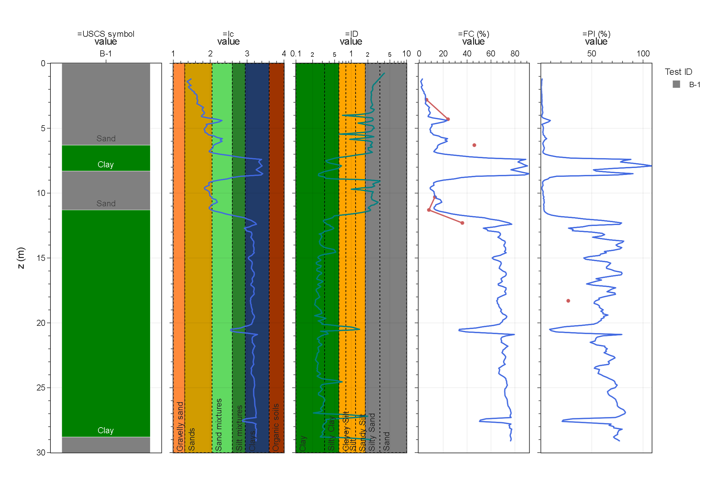
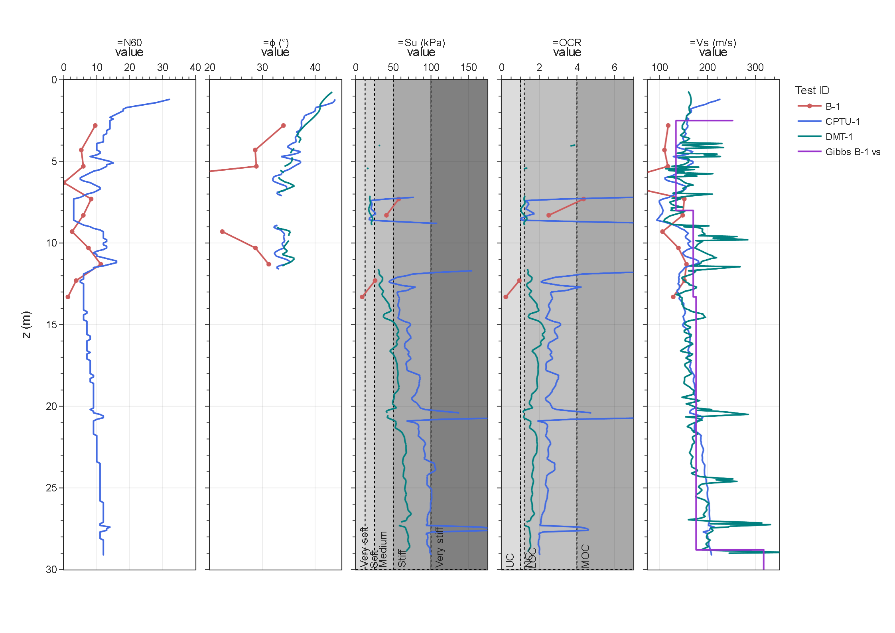
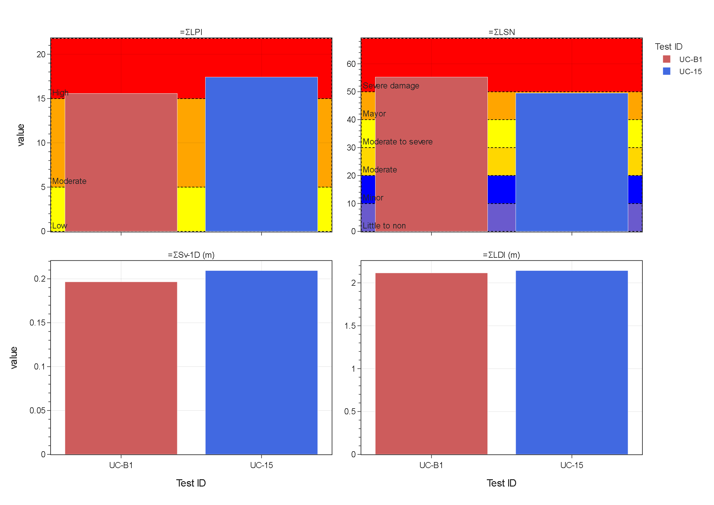
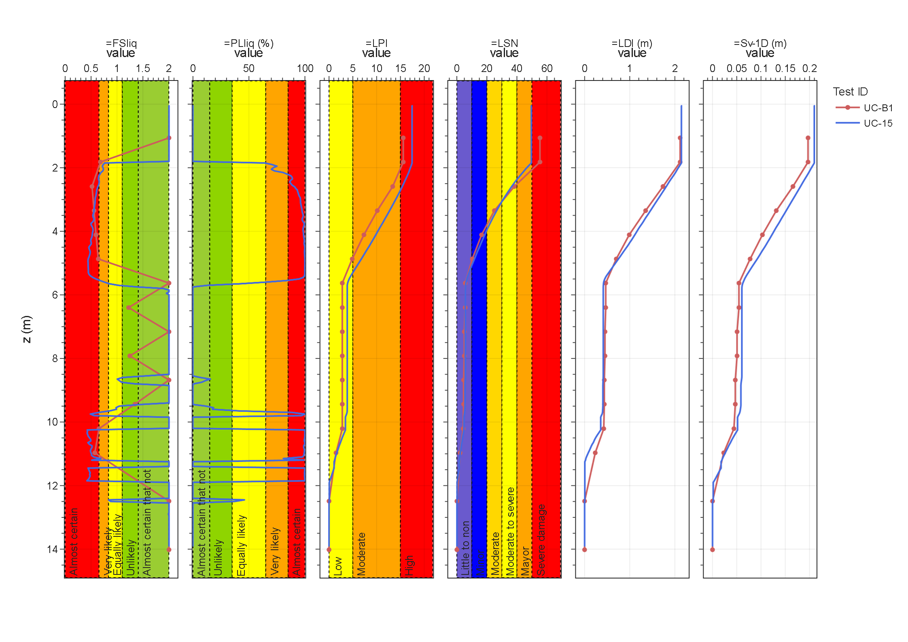

# Gallery

Filled logs, interpretation plots, and liquefaction profiles from open site
data. Empty chart templates, hatches, and named registries live in the
[catalog](../catalog/index.md). Try the same workflows in the
[web app](https://subsurfaceio.app/){:target="_blank"}.

## Graphical logs

### Borehole log — UC-B1, Moss Landing

Boring log from Next-Generation Liquefaction data (Boulanger et al. 1995).
Lithology, sampler, SPT N, and laboratory columns in a conventional log
layout.

{: .gallery-still }
{: .gallery-still }

### CPT log — UC-15, Moss Landing

Cone log for sounding UC-15, next to UC-B1 on the Moss Landing site map
(Boulanger et al. 1995). Sleeve friction, cone resistance, friction ratio,
and pore pressure. One page, 15 m depth span.

{: .gallery-still }

## Interpretation

### Site CPT profile — Treasure Island

All CPTs in gray; black is the site characteristic profile on a common
depth grid (Gibbs et al. 1992 USGS). Raw traces: tip, sleeve, and pore
pressure.

{: .gallery-still }

### Interpreted profiles — Treasure Island

Borehole B-1, CPTU-1, DMT-1, and downhole Vs at Gibbs B-1 vs (Pass et al.
1994; Gibbs et al. 1992 USGS). Depth is shown to 30 m.

Classification and index:

{: .gallery-still }

Strength and stiffness:

{: .gallery-still }

## Liquefaction

### Profile sums — Moss Landing

UC-B1 and UC-15 with the Idriss and Boulanger (2014) framework (Boulanger
et al. 1995). Bar summary of LPI, LSN, volumetric settlement, and lateral
displacement index.

{: .gallery-still }

### Triggering vs depth — Moss Landing

The same two tests vs depth. Safety factor, probability, LPI, LSN, lateral
displacement index, and volumetric settlement.

{: .gallery-still }
