### AASHTOPlasticityChart
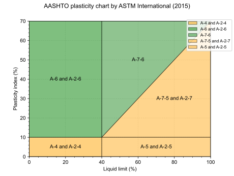
### AtterbergLimits
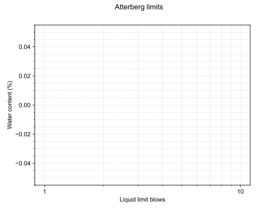
### BasicInfluenceFactorI1
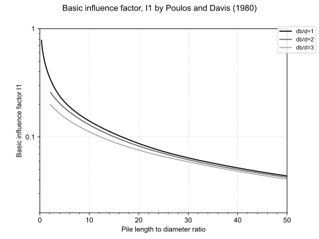
### CoefficientOfConsolidationNAVFAC1982
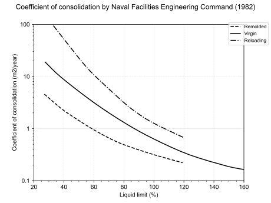
### CompressionRatioLambe1969
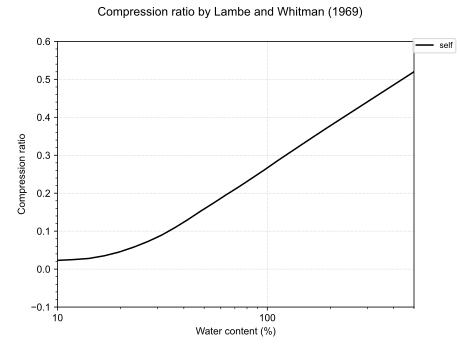
### CrossCorrelation

### DiameterAt50PercentFinerSaye2017
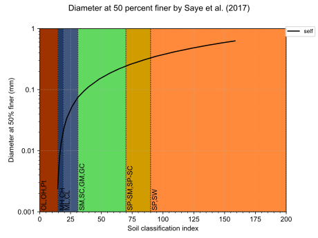
### FinesContentSaye2017
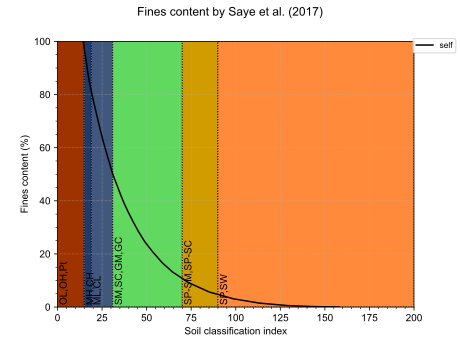
### FootingFoundationCapacity
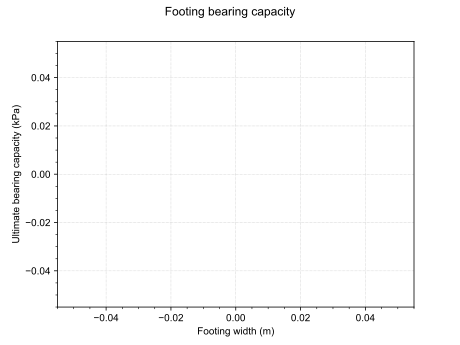
### HydrometerAnalysis
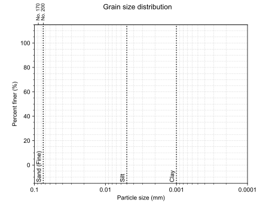
### LiquefactionDamage
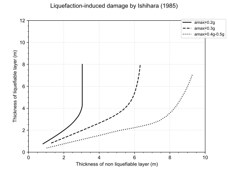
### LiquefactionSusceptibility
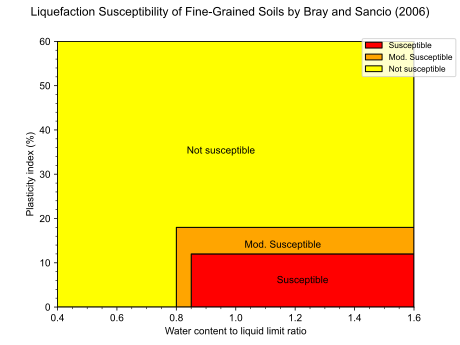
### ModifiedSoilBehaviourType
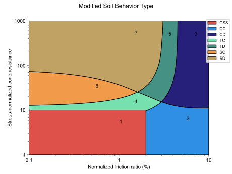
### NatureOfSoil
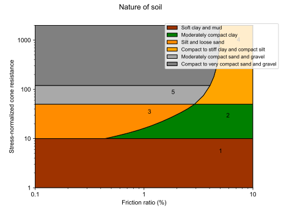
### NormalizedConeResistanceFinesIncSeed1987
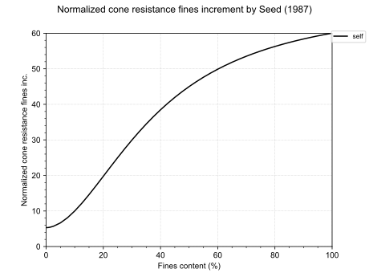
### NormalizedSoilBehaviourType
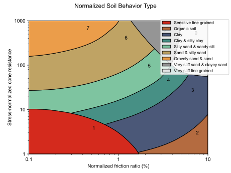
### NormalizedSoilBehaviourTypeCompactability
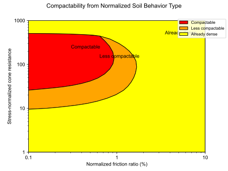
### PeriodLengtheningRatio
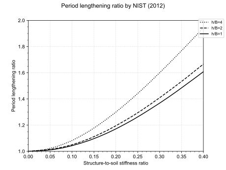
### PileFrictionCoefficient1Semple1984
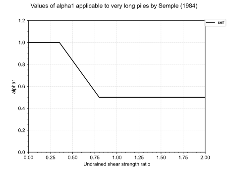
### PileFrictionCoefficient2Semple1984
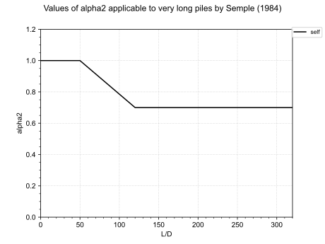
### PileFrictionCoefficientAPI1975
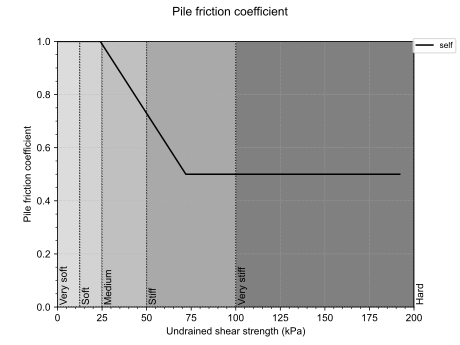
### PileGroupDampingRatioX
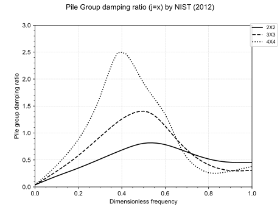
### PileGroupDampingRatioYY
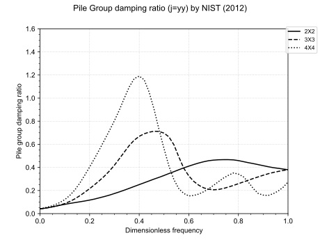
### PileGroupDampingRatioZ
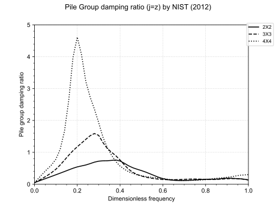
### PileGroupEfficiencyFactorX
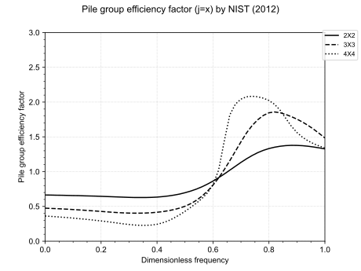
### PileGroupEfficiencyFactorYY
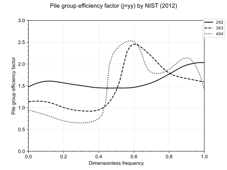
### PileGroupEfficiencyFactorZ
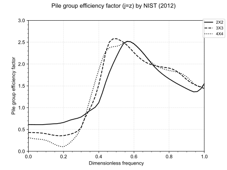
### PileSettlementCorrectionBearingLd10
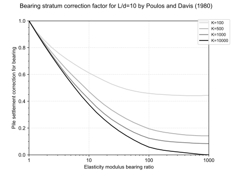
### PileSettlementCorrectionBearingLd25
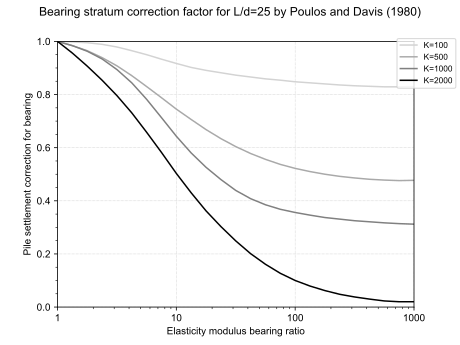
### PileSettlementCorrectionBearingLd5
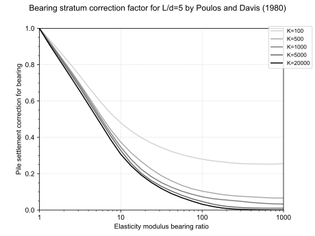
### PileSettlementCorrectionBearingLd50
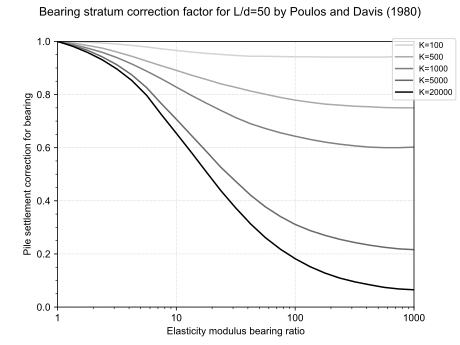
### PileSettlementCorrectionBearingLd75
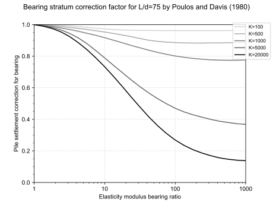
### PileSettlementCorrectionCompressibility
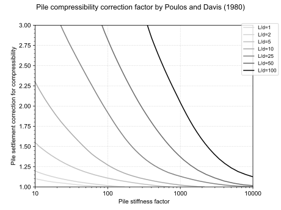
### PileSettlementCorrectionDepth
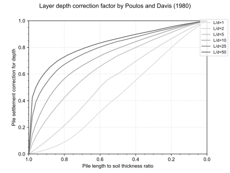
### PileSettlementCorrectionPoisson
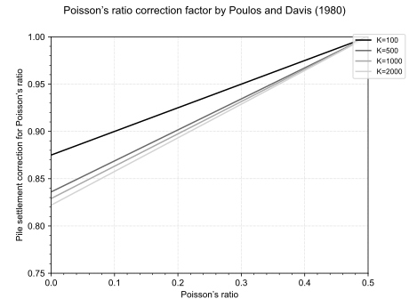
### PunchingShearCoefficientMeyerhof1978
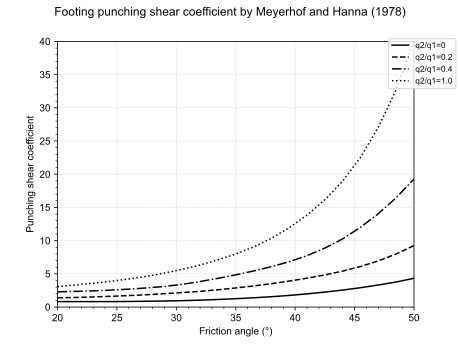
### RelativeDensityReyna1991
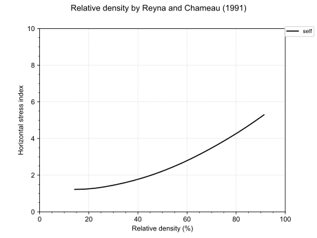
### ResponseSpectra
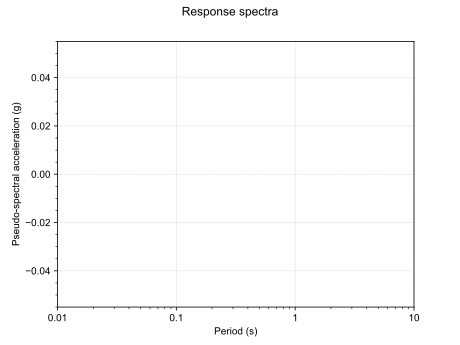
### SieveAnalysis
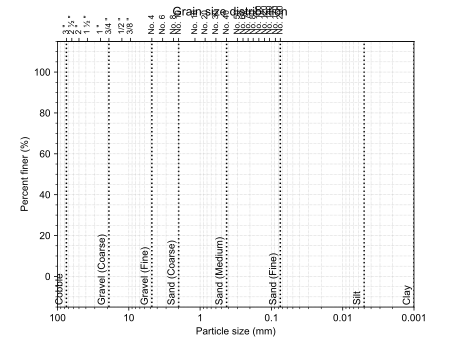
### SoilBehaviourType

### SoilBehaviourTypeDMT
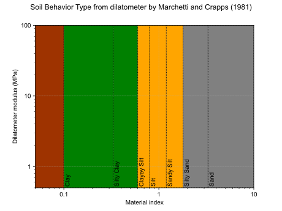
### SoilBehaviourTypeSchneider
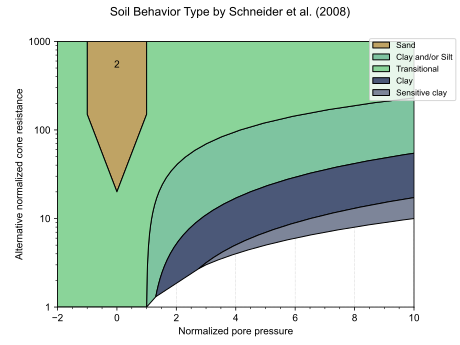
### SoilTypeIndex
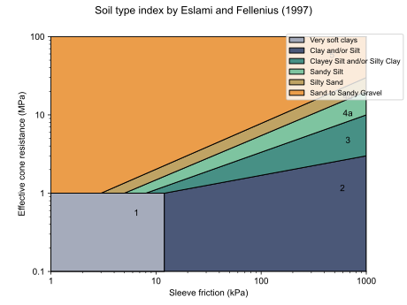
### UnitAdhesionToCohesionRatioMeyerhof1978
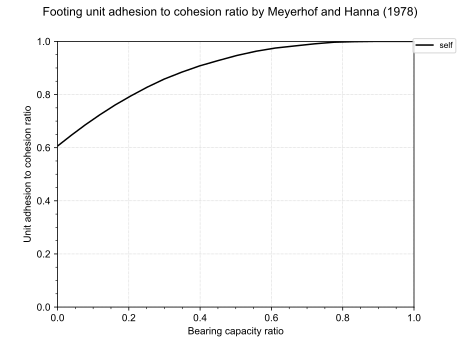
### USCSMoreno2018PlasticityChart
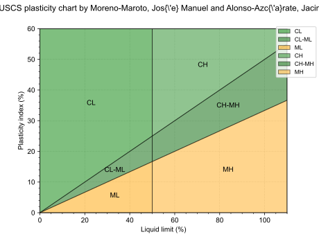
### USCSPlasticityChart
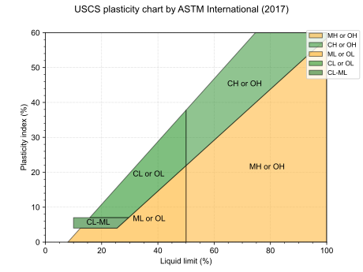
### USDAMoreno2018Chart
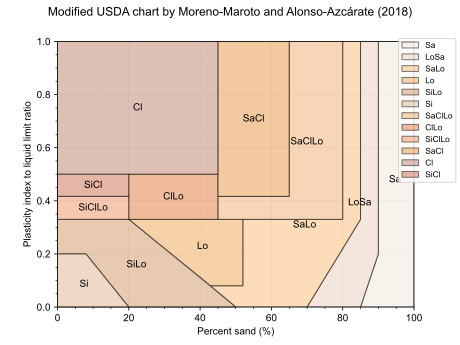
### USDATernaryChart
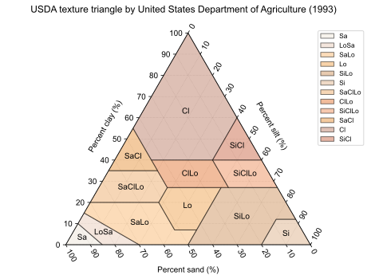